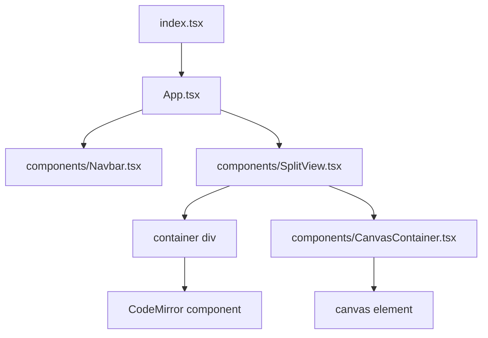

<p align="center">
  
</p>

(See the [tutorial](https://github.com/brandon-gong/pico/blob/main/tutorial.md) if you want to get started using Pico!)

Pico is an environment for creating generative, procedural art
with JavaScript on a very low level. Users provide a function that takes in
a pixel's X and Y coordinates (and some other optional data) and returns a color
value.

## Examples
Click the title to view the corresponding source code for each example sketch.

### [Red square](https://github.com/brandon-gong/pico/blob/main/examples/red_square.js)


### [Gradient](https://github.com/brandon-gong/pico/blob/main/examples/gradient.js)


### [Checkerboard](https://github.com/brandon-gong/pico/blob/main/examples/checkerboard.js)


### [Metaballs](https://github.com/brandon-gong/pico/blob/main/examples/metaballs.js)


### [Mandelbrot](https://github.com/brandon-gong/pico/blob/main/examples/mandelbrot.js)


## Project structure
The `public` folder contains the basic HTML skeleton of the page.
Anything that should go in `<head>`, e.g. meta tags, title should
be added to `public/index.html`. This folder also contains Pico logo
icons for browser and mobile bookmarks.

The `src` folder contains the actual React app. This project is built
using React and TypeScript, based on the command `npx create-react-app pico --template typescript`.

The component tree is as follows:


- Most of the application state is stored in the `App` component's state.
This includes the current user code, handles for all running rendering
callbacks, and error messages. `App` also handles logic for starting
and stopping rendering tasks based on callbacks triggered by the `Navbar`
component upon button press, or by keyboard shortcut. Finally, `App`
calls `run()` from `Runner.ts` to start rendering tasks using user code
(covered in more detail below).
- The `Navbar` is relatively simple, just containing the logo and three
buttons. This may be expanded upon in the future. The buttons are icons
from the `src/assets` folder. On click, they may start or stop the
program, or send the user to an outside link (the blog tutorial).
  - To determine which icon to use when rendering the buttons, `Navbar`
    receives props from `App` that vary based on if the code is running
    or not. This allows the buttons to appear responsive (a green play
    button while the task is running, a red stop button while it is
    stopped).
- The `SplitView` is rendered physically right below the `Navbar` on
  the screen. Its job is to contain two elements, the CodeMirror pane and
  the preview pane. It allows the user to drag a divider to resize the
  two panes, and it does so by keeping an internal state of the divider's
  current position and registering a global listener while a drag is
  active to adjust the state.
  - The left side of the `SplitView` is a containing div, which simply
  manages overflow in either direction (causing scroll instead of the
  CodeMirror element resizing itself and pushing other elements around),
  which contains the `CodeMirror` component from `@uiwjs/react-codemirror`.
  - The right side of the `SplitView` is a `CanvasContainer` element
  which, like the CodeMirror container, manages scroll, but also receives
  props from `App` containing error message data and situationally hides
  the `<canvas>` element to show error messages.

`index.css` contains styles for the whole app. Most of mobile
friendliness is achieved here, using CSS media queries. In the future, it
would be necessary to achieve better mouse support on mobile using some
third-party library for touch interactions.

The primary functionality of the program is achieved by `Runner.ts`.
It provides several key functions:
- The JavaScript global `Math` module is hidden from the user. This is
  done like so: An internal reference to `Math` is
  stored. Prior to running the user's code, `Math` is reassigned to
  `undefined`. Once the user code has finished running, `Math` is
  restored.
- The user's code is wrapped in a call to the `Function` constructor
  around some support code. This support code provides the user with
  necessary math functions to work with (e.g. `sin`, `cos`), and also
  predefined config variables `width`, `height`, and `loop`. The
  support code also returns everything necessary (those config
  variables, plus the user-defined function `color`) in an Object
  after evaluation.
  - Yes, `Function` is `eval()`, but users are only running code on their
    own machines, so its less of an issue. Will need to be careful if
    logins and sharing are ever implemented.
- For each pixel, the user's code is re-evaluated (necessary to
  eliminate global state) as a thunk, and then the resulting `color`
  function is run.
- The canvas element is updated with the final data each frame.
- `Runner` catches all errors so instead of crashing the entire Pico,
  it returns that error message to `App` by calling the `setError`
  callback and stops execution gracefully.
- All IDs returned from `setInterval` are saved in a React ref from `App`
  for bookkeeping purposes; this allows running rendering tasks to be
  cleared and restarted easily.

## Building and running
Feel free to hack on this project and contribute!
To run this project locally, you need to have `npm` installed.
- Clone this repository to your local machine.
  ```sh
  git clone https://github.com/brandon-gong/pico.git
  cd pico
  ```
- Install all dependencies for the project.
  ```sh
  npm install
  ```
- Start the project running. After this, all changes to the source
  code will be automatically compiled and updated on the page.
  ```sh
  npm start
  ```
The below note only applies to those who have push access to this
repository (me only currently).
- To deploy the project to GitHub pages, the relevant changes have
  already been made in `package.json`. Simply run
  ```sh
  npm run deploy
  ```

## Final thoughts
This project was tossed together in literally one day, so there are
of course still some features to be desired. Off the top of my head,
- Better error reporting. This is a bit hard to do, since JS doesn't throw very accurate errors for blobbed code, but it would
make it much more usable to see red squigglies in the code.
- Investigate further into Web Workers. I did try this, but it significantly decreased the performance compared to doing it on the main thread. The two main motives are to not lag the main thread (and crash the tab) when doing heavy computations, and to also possibly speed things up, since this is an [embarrassingly parallel](https://en.wikipedia.org/wiki/Embarrassingly_parallel) task.
- Saving files. Currently users can only save one file, and its
stored in `localStorage`, which is by no means a reliable place to
put things. But I'm not quite sure how to implement this without
implementing user logins, which I am not that interested in doing. Contributions are welcome.
