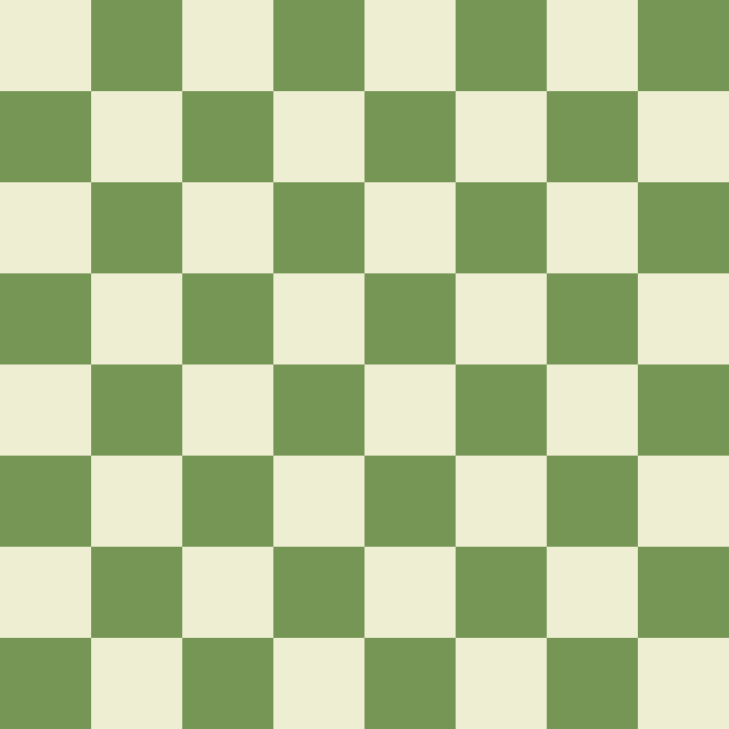

<p align="center">
  
</p>

Pico is an environment for creating generative, procedural art
with JavaScript, given incredibly little to work with.

Go play around with it [here](https://www.brandongong.org/pico/)! Or,
peruse some examples of what can be achieved with it on my ~~blog~~ (coming soon).

## What is it?
Images, at least in the digital sense, are essentially 2D arrays of
pixels. We can call the pixel at the top-left of an image `(0,0)`,
the pixel immediately to its right `(1,0)`, and so on.

Your sole job is to define a function, `color`, which takes in the
x-y coordinates of a pixel and returns back the color it should be.

That's all you have to work with – no concept of shared state between pixels, no remembering what the previous color of the pixel
was. And on top of that, you're missing a lot of potentially helpful functions from the JavaScript `Math` library!

For example, the below code generates a pure red image, because
regardless of the provided coordinates, it returns the array `[255, 0, 0]`, equivalent to the hex code `#FF0000`.

```javascript
function color(x, y) {
  return [255, 0, 0];
}
```
<p align="center">
  
</p>

We can already start get a bit more complexity by varying the 
pixel color relative to its x-position in the image:

```javascript
function color(x, y) {
  return [255, x / width * 255, 0];
}
```
<p align="center">
  
</p>

You can already start imagining the possibilities; I am only doing
basic division and multiplication, but any logic in JavaScript is
possible; can you think about how to draw a circle? How about a
checkerboard? Go try it out [here](https://www.brandongong.org/pico/)!

## More examples
Try copying the accompanying snippets into the Pico editor and
playing around with them. How do your changes make the resulting
image different?

### Checkerboard
<p align="center">
  
</p>

```javascript
function color(x, y) {
  let column = floor(y / height * 8);
  let row = floor(x / width * 8);

  if ((column + row) % 2 == 0) return [238, 238, 210];
  else return [118, 150, 86];
}
```

### Metaballs
<p align="center">
  
</p>

```javascript
let sqrt = (x) => pow(x, 0.5);
let sq = (x) => pow(x, 2);

function invHypot(a, b) {
  return 1 / sqrt(sq(a[0] - b[0]) + sq(a[1] - b[1]));
}

function normalize(a) {
  return [a[0] / width, a[1] / height];
}

function smoothstep(edge0, edge1, x) {
   if (x < edge0) return 0;
   else if (x >= edge1) return 1;

   x = (x - edge0) / (edge1 - edge0);
   return x * x * (3 - 2 * x);
}

function color(x, y, f, mouseX, mouseY) {
  let mb1 = [0.5, 0.5];
  let mb2 = normalize([mouseX, mouseY]);
  let pos = normalize([x, y]);

  let mbTotal = invHypot(pos, mb1) + invHypot(pos, mb2);
  mbTotal = smoothstep(9.9, 10, mbTotal);
  mbTotal *= 255;

  return [mbTotal, mbTotal, mbTotal];
}
```


## How does it compare to other graphics libraries?
Pico is a toy. It (by design) lacks incredibly useful drawing
functions for cicles, lines, triangles, text, etc. that any other
reasonable graphics library would have (e.g. Processing, 
OpenFrameworks).

It is also much, much less performant than its inspiration,
GLSL. (If you happen to like Pico, then you'll probably like
GLSL! [Shadertoy](https://www.shadertoy.com/) is like the "next
step up" from Pico).

But its barebones simplicity makes it much more accessible than
the relatively complex APIs of well-built graphics libraries.
No need to spend time digging through API docs because – well,
there's pretty much nothing given to you :).

And JavaScript is much more popular, less pedantic, and generally
easier to work with than GLSL for the majority of people. Thus
Pico is a kind of playground for people to enjoy the challenge of
creating complexity in such a constrained environment without
having to deal with learning all the incredibly confusing concepts
of OpenGL.

## Additional Features
Since my generosity is unbounded, Pico _does provide_ you with
functions that would be nearly impossible to implement, namely
```
sin cos tan asin acos atan atan2 sinh cosh tanh asinh acosh atanh log pow floor ceil
```
They are called in the exact same manner as the builtin functions from `Math`.

You can also control the size of the canvas by setting the
width and height variables; for example, the code below creates
a black image that is 314 pixels tall, 271 pixels wide:
```javascript
width = 271;
height = 314;

function color(x, y) {
  return [0, 0, 0];
}
```

For particularly expensive sketches, your tab may lag. To disable
looped rendering, you can also set `loop = false` to only render
the image for one frame.

Speaking of, I lied a bit earlier when I said you only get two
values for your `color` function – you can actually get up to
six, as documented below:
```javascript
function color(x, y, f, mx, my, md);
```
- `x` is the index of the pixel along the x axis, with 0 on the left and increasing towards the right.
- `y` is the index of the pixel along the y axis, with 0 on the top and increasing moving downwards.
- `f` is the index of the current frame. This starts from zero and is incremented per frame. This allows you to create animations, where the color of a pixel depends not only on its position, but also how long it has been since the code started running.
- `mx` and `my` are the x- and y-coordinates of the mouse cursor, respectively. You can use these values to make your sketch interactive.
- `md` is true if any mouse buttons are clicked, false otherwise.

## Final thoughts
This project was tossed together in literally one day, so there are
of course still some features to be desired. Off the top of my head,
- Mobile friendliness. This is definitely not done.
- Better error reporting. This is a bit hard to do, since JS doesn't throw very accurate errors for blobbed code, but it would
make it much more usable to see red squigglies in the code.
- Investigate further into Web Workers. I did try this, but it significantly decreased the performance compared to doing it on the main thread. The two main motives are to not lag the main thread (and crash the tab) when doing heavy computations, and to also possibly speed things up, since this is an [embarrassingly parallel](https://en.wikipedia.org/wiki/Embarrassingly_parallel) task.
- Saving files. Currently users can only save one file, and its
stored in `localStorage`, which is by no means a reliable place to
put things. But I'm not quite sure how to implement this without
implementing user logins, which I am not that interested in doing. Contributions are welcome